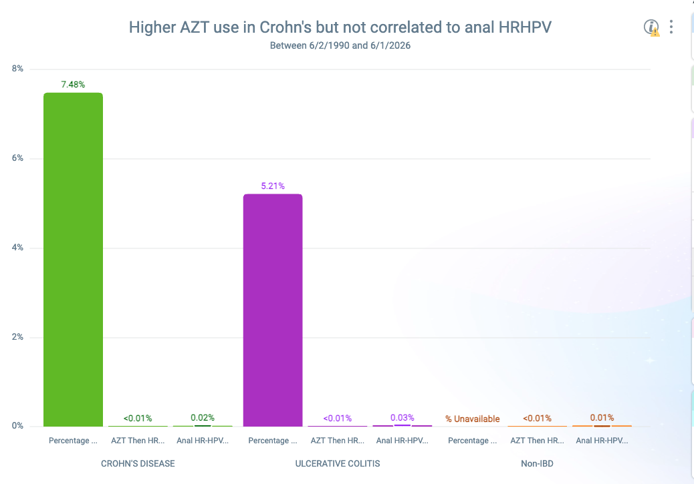

# Increased Prevalence of High-Risk HPV+ DNA of Rectal cells in IBD Patients

Prior studies have established an increased rate of anal cancer in patients with IBD. Per *Albuquerque et al.*, the incidence of anal cancer per 100k person-years is as follows: 2 in the general population. 7.7 in Crohn's, and 10.2 in Ulcerative Colitis. Notably, if a Crohn's patient had prior perianal disease, it was 19.6 per 100k person-years, or *10 times* the incidence. [@albuquerque2023]

When looking at IBD patients in general within the Epic Cosmos dataset, we also found there is a nearly 10x rate of anal cancer (Figure 1). 

{fig-align="left" width="572"}


## A Doubling and Tripling of High-Risk HPV+ DNA in Anal cells in IBD

When separating by Crohn's vs Ulcerative Colitis, there is an increased prevalence amongst Ulcerative Colitis. 

{fig-align="left" width="572"}

## Perianal Disease in Crohn's

This relative increase in UC is true in most sectors we analysed, the one exception being prior perianal disease - in that case, Crohn's patients had the higher prevalence. This is consistent with *Albuquerque et al.*'s finding of high prevalence of anal cancer with Crohn's patients with perianal disease. 

Of note, It is unclear what role surveillance of the IBD population may have affected discovery. For example, patients with perianal disease may be more likely to be evaluated. 

However, if there is a high ratio of perianal disease patients that develop anal cancer, surveillance alone may not explain the higher rates. In a previous surgical study of a group of 33 IBD patients by *Slessler et al.* found that 85% of Crohn's patients with anal cancer previously had perianal disease. However, this was specifically a group of anal SCC patients, so it is difficult to assess how this group relates to the larger body of Crohn's patients with perianal disease. 

### Severity and Aggression of Anal Cancers in Crohn's patients

*Slessler et al.* noted earlier age of presentation and poorer outcomes with the select group of anal SCC patients in their retrospective analysis. I think this is something we should dig deeper into - how do we measure severity - is a combination of staging of the malignancy and age enough of a metric? 

## Anal Sparing in Ulcerative Colitis

While rectal involvement is Ulcerative Colitis is nearly universal, the anal canal is generally spared. This would seem to contradict the data that shows a higher rate of anal cancer in UC patients. High-Risk HPV rates are also increased at this location, which may factor into the higher rates of anal cancer.

## Azathioprine Use Does Not Seem to Correlate

Does not seem to be correlate. There was a higher use rate of Azathioprine for patients who had Crohn's (7.48%) than Ulcerative Colitis (5.21%). However, when looking at patients with both IBD and anal HRHPV+ DHA, less than 10% of Anal HRHPV+ Crohn's patients were on Azathioprine, and less than 5% of Anal HRHPV+ UC patients were on Azathioprine. d



## Perianal Disease and Anal Cancer

About 22% of Crohn's patients with Anal Cancer had Perianal disease in the 5 years prior to diagnosis (559/2535). For UC, that about 15% had prior perianal disease (474/3227). Chi-Square of 52.3, p<0.001. 


```{r}
#| label: perianal-disease-anal-cancer-chi-square
perianal_anal_cancer_counts <- matrix(
  c(
    559, 2535 - 559,
    474, 3227 - 474
  ),
  nrow = 2,
  byrow = TRUE
)

rownames(perianal_anal_cancer_counts) <- c(
  "Crohn disease",
  "Ulcerative colitis"
)

colnames(perianal_anal_cancer_counts) <- c(
  "Prior perianal disease",
  "No prior perianal disease"
)

perianal_anal_cancer_chi_square <- chisq.test(
  perianal_anal_cancer_counts,
  correct = FALSE
)

perianal_anal_cancer_counts
perianal_anal_cancer_chi_square
```

Pearson chi-square testing showed that prior perianal disease was significantly more common among Crohn's patients with anal cancer than UC patients with anal cancer, X^2^(1) = 52.3, p < 0.001.

## Future Proposals

With the higher rates of High-Risk HPV positive DNA in IBD patients, regular screening for these patients may have an outsized effect on rates of anal cancer.

A large-volume study of screenings, especially tied to rates of Azathioprine use, history of Perianal involvement, and


Further study that may be of benefit, to stratify the population:

Progression to Anal Cancer

History of perianal disease - a prior small cohort analysis of 33 IBD patient with anal cancer noted an 85% prevalence of perianal disease for Crohn's patients with anal cancer [@slesser2013]. Perianal disease may point

Immunosuppressive medication use - analysis of patients' history of Azathioprine, which is known to have a connection to cervical cancer

Rates of Anal HPV or Anal cancer in CVID patients