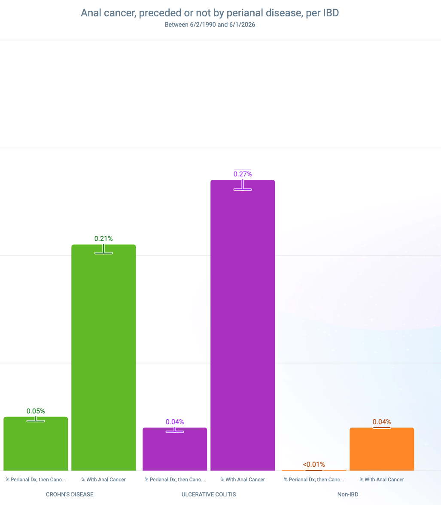

# Increased Prevalence of High-Risk HPV+ DNA of Rectal cells in IBD Patients

Prior studies have established an increased rate of anal cancer in patients with IBD. *Albuquerque et al.* noted that an incidence of anal cancer of 2 per 100k person-years in the general population. They then noted a 7.7 per 100k in Crohn's, and 10.2 per 100k in Ulcerative Colitis. In Crohn's patients with prior perianal disease, the incidence was even higher - 19.6 per 100k person-years, or *10 times* the incidence. [@albuquerque2023]

When looking at IBD patients in general within the Epic Cosmos dataset, we also found there is a nearly 10x rate of anal cancer (Figure 1). When separating by Crohn's vs Ulcerative Colitis, there is an increased prevalence amongst Ulcerative Colitis, noting

{fig-align="left" width="572"}

## A Doubling and Tripling of High-Risk HPV+ DNA in Anal cells in IBD

{fig-align="left" width="572"}

## Perianal Disease in Crohn's

In a previous surgical study of a group of 33 IBD patients by *Slessler et al.*, 85% of Crohn's patients had perianal disease.

Of note, It is unclear what role surveillance of the IBD population may have affected discovery. For example, patients with perianal disease may be more likely to be evaluated. However, if there is a high ratio of perianal disease patients that develop anal cancer, surveillance alone may not explain the higher rates.

## Anal Sparing in Ulcerative Colitis

While rectal involvement is Ulcerative Colitis is nearly universal, the anal canal is generally spared. This would seem to contradict the data that shows a higher rate of anal cancer in UC patients. High-Risk HPV rates are also increased at this location, which may factor into the higher rates of anal cancer.

## Azathioprine Use Does Not Seem to Correlate

Does not seem to be correlate. There was a higher use rate of Azathioprine for patients who had Crohn's (7.48%) than Ulcerative Colitis (5.21%). However, when looking at patients with both IBD and anal HRHPV+ DHA, less than 10% of Anal HRHPV+ Crohn's patients were on Azathioprine, and less than 5% of Anal HRHPV+ UC patients were on Azathioprine. d


## Perianal Disease and Anal Cancer

About 22% of Crohn's patients with Anal Cancer had Perianal disease in the 5 years prior to diagnosis (559/2535). For UC, that about 15% had prior perianal disease (474/3227). Chi-Square of 52.3, p<0.001. 

{width="479"}

```{r}
#| label: perianal-disease-anal-cancer-chi-square
#| echo: true
perianal_anal_cancer_counts <- matrix(
  c(
    559, 2535 - 559,
    474, 3227 - 474
  ),
  nrow = 2,
  byrow = TRUE
)

rownames(perianal_anal_cancer_counts) <- c(
  "Crohn disease",
  "Ulcerative colitis"
)

colnames(perianal_anal_cancer_counts) <- c(
  "Prior perianal disease",
  "No prior perianal disease"
)

perianal_anal_cancer_chi_square <- chisq.test(
  perianal_anal_cancer_counts,
  correct = FALSE
)

perianal_anal_cancer_counts
perianal_anal_cancer_chi_square
```

Pearson chi-square testing showed that prior perianal disease was significantly more common among Crohn's patients with anal cancer than UC patients with anal cancer, X^2^(1) = 52.3, p < 0.001.

## Future Proposals

With the higher rates of High-Risk HPV positive DNA in IBD patients, regular screening for these patients may have an outsized effect on rates of anal cancer.

A large-volume study of screenings, especially tied to rates of Azathioprine use, history of Perianal involvement, and